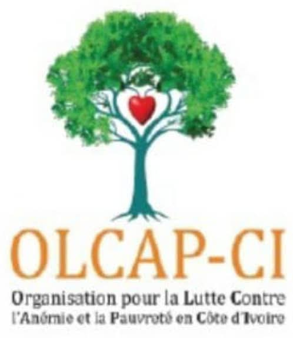

# OLCAP-CI - Site Web Officiel



## 📋 À propos

Site web officiel de l'ONG **OLCAP-CI** (Organisation de Lutte Contre l'Anémie et la Pauvreté en Côte d'Ivoire), une organisation non gouvernementale dédiée à la lutte contre l'anémie, la pauvreté, l'analphabétisme, et les cancers du sein et du col de l'utérus.

## 🎯 Mission

Améliorer la santé et le bien-être des populations ivoiriennes à travers :
- La sensibilisation et le dépistage des cancers féminins
- La lutte contre l'anémie
- La promotion de l'éducation sanitaire
- Le soutien aux populations vulnérables

## 🌟 Fonctionnalités

### 💳 Système de Dons Sécurisés
- Intégration **Paystack** pour les paiements en ligne
- Formulaire de don sécurisé avec validation
- Confirmation par email (Resend)
- Suivi des transactions en temps réel
- Stockage sécurisé dans Supabase avec RLS activé

### 🤖 Chatbot Intelligent
- Chatbot alimenté par **OpenAI GPT-4.0-mini**
- Système RAG (Retrieval-Augmented Generation) pour des réponses rapides
- Base de connaissances préchargée avec 12+ FAQ
- Incitation aux dons et contact WhatsApp
- Réponses contextuelles sur la mission et les actions de l'ONG

### 📞 Contact Direct
- Bouton **WhatsApp** flottant pour contact instantané
- Formulaire de contact intégré
- Informations de contact accessibles

### ❓ FAQ Interactive
- Section FAQ avec recherche en temps réel
- Filtres par catégorie (Général, Santé, Dons, Bénévolat)
- 10 questions-réponses détaillées
- Interface moderne avec icônes et tags

### 📱 Design Responsive
- Interface adaptative mobile-first
- Animations et transitions fluides
- Design moderne avec Tailwind CSS
- Thème cohérent avec tokens CSS personnalisés

## 🛠️ Technologies Utilisées

### Frontend
- **React 18.3.1** - Framework JavaScript
- **TypeScript** - Typage statique
- **Vite** - Build tool et dev server
- **Tailwind CSS** - Framework CSS utility-first
- **shadcn/ui** - Composants UI réutilisables
- **React Router DOM** - Navigation SPA
- **React Query** - Gestion d'état et cache

### Backend & Services
- **Supabase** - Backend as a Service
  - Base de données PostgreSQL
  - Edge Functions (Deno)
  - Authentification
  - Row Level Security (RLS)
- **OpenAI API** - Intelligence artificielle (GPT-4.0-mini)
- **Paystack** - Passerelle de paiement
- **Resend** - Service d'envoi d'emails

### Bibliothèques Principales
- **@supabase/supabase-js** - Client Supabase
- **@tanstack/react-query** - Gestion des requêtes
- **lucide-react** - Icônes
- **react-hook-form** - Gestion des formulaires
- **zod** - Validation de schémas
- **sonner** - Notifications toast
- **class-variance-authority** - Gestion des variants CSS

## 📦 Installation

### Prérequis
- **Node.js** >= 18.x
- **npm** ou **bun**
- Un projet **Supabase** configuré
- Clés API pour :
  - OpenAI
  - Paystack
  - Resend (optionnel)

### Étapes d'installation

1. **Cloner le repository**
```bash
git clone <URL_DU_REPO>
cd olcap-ci
```

2. **Installer les dépendances**
```bash
npm install
# ou
bun install
```

3. **Configurer les variables d'environnement**

Créer un fichier `.env` à la racine :
```env
VITE_SUPABASE_URL=https://lceuznoxizqibnxazzge.supabase.co
VITE_SUPABASE_ANON_KEY=votre_anon_key
```

4. **Configurer les secrets Supabase**

Dans votre projet Supabase, ajouter les secrets suivants (Settings > Edge Functions > Secrets) :
```
OPENAI_API_KEY=sk-...
PAYSTACK_SECRET_KEY=sk_...
PAYSTACK_PUBLIC_KEY=pk_...
RESEND_API_KEY=re_...
```

5. **Déployer les Edge Functions**

Les Edge Functions sont déployées automatiquement via Lovable. Les fonctions disponibles :
- `olcap-chatbot` - Gestion du chatbot IA
- `paystack-donation` - Initialisation des dons
- `paystack-webhook` - Webhooks Paystack

6. **Lancer le serveur de développement**
```bash
npm run dev
# ou
bun dev
```

L'application sera accessible sur `http://localhost:8080`

## 🗂️ Structure du Projet

```
olcap-ci/
├── public/
│   ├── robots.txt
│   └── favicon.ico
├── src/
│   ├── assets/              # Images et ressources
│   ├── components/          # Composants React
│   │   ├── Layout/          # Header, Footer, Layout
│   │   ├── FAQ/             # Section FAQ
│   │   ├── ui/              # Composants shadcn/ui
│   │   ├── Chatbot.tsx      # Chatbot IA
│   │   └── WhatsAppButton.tsx
│   ├── hooks/               # Custom hooks
│   ├── integrations/        # Intégrations externes
│   │   └── supabase/
│   ├── lib/                 # Utilitaires
│   ├── pages/               # Pages de l'application
│   │   ├── Home.tsx
│   │   ├── Mission.tsx
│   │   ├── Projets.tsx
│   │   ├── Contact.tsx
│   │   ├── Don.tsx
│   │   └── ...
│   ├── App.tsx              # Composant racine
│   ├── main.tsx             # Point d'entrée
│   └── index.css            # Styles globaux
├── supabase/
│   ├── functions/           # Edge Functions
│   │   ├── olcap-chatbot/
│   │   ├── paystack-donation/
│   │   └── paystack-webhook/
│   └── config.toml          # Configuration Supabase
└── package.json
```

## 🚀 Déploiement

### Avec Lovable
1. Ouvrir le projet dans [Lovable](https://lovable.dev)
2. Cliquer sur **Publish** dans le coin supérieur droit
3. Le site sera déployé automatiquement

### Avec Vercel/Netlify
```bash
# Build de production
npm run build

# Le dossier dist/ contient les fichiers statiques
```

## 🔒 Sécurité

- **RLS (Row Level Security)** activé sur toutes les tables Supabase
- Validation des données côté serveur et client (Zod)
- Secrets stockés dans l'environnement Supabase
- HTTPS forcé en production
- CORS configuré sur les Edge Functions

## 📊 Base de Données

### Tables Principales
- `donations` - Transactions de dons
  - Champs : id, donor_name, email, amount, status, reference, etc.
  - RLS : Lecture publique, écriture via Edge Function

## 🌐 Pages Disponibles

- `/` - Page d'accueil
- `/mission` - Notre mission
- `/equipe` - Notre équipe
- `/projets` - Nos projets
- `/contact` - Nous contacter
- `/don` - Faire un don
- `/don/success` - Confirmation de don
- `/mentions-legales` - Mentions légales

## 📞 Contact

- **Adresse** : Ananeraie, Yopougon, Abidjan – Côte d'Ivoire
- **Téléphones** : 
  - +225 01 51 83 82 82
  - +225 05 95 20 33 72
- **Email** : olcapcin@gmail.com
- **WhatsApp** : +225 01 51 83 82 82

## 🤝 Contribution

Les contributions sont les bienvenues ! Pour contribuer :
1. Fork le projet
2. Créer une branche (`git checkout -b feature/amelioration`)
3. Commit les changements (`git commit -m 'Ajout fonctionnalité'`)
4. Push vers la branche (`git push origin feature/amelioration`)
5. Ouvrir une Pull Request

## 📝 Licence

Ce projet est développé pour l'ONG OLCAP-CI. Tous droits réservés.

## 🙏 Remerciements

- Équipe OLCAP-CI
- Communauté Lovable
- Contributeurs open-source

---

**Développé avec ❤️ pour améliorer la santé en Côte d'Ivoire**
